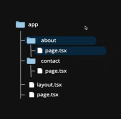

# Next.js Overview

## What is Next.js?

Next.js is a **React-based framework** designed for building **full‑stack, production‑ready web applications**.

While **React** focuses mainly on creating user interfaces, building a complete production application with React alone requires installing and configuring extra libraries for:

- Routing
- Data fetching
- API handling
- Optimization

Next.js solves this by providing all these features **built-in**, while still using React for UI development.

### Key Features of Next.js

- File‑based routing
- API routes
- Optimized rendering (SSR, SSG, ISR)
- Built‑in data fetching methods
- Automatic bundling and compiling
- Image and font optimization
- Full development and production build system

Next.js allows you to build scalable applications **without installing additional packages** for common features—as long as you follow its conventions.

---

## Why Next.js?

Next.js makes it easier to create **production-ready** web apps thanks to its powerful built-in tools.

### What it provides:

1. **Routing** (pages or app router)
2. **API Routing** (backend inside your frontend project)
3. **Rendering Options** (SSR, SSG, CSR, ISR)
4. **Data Fetching** (server/components-based)
5. **Styling Support** (CSS modules, Tailwind, etc.)
6. **Performance Optimization** (images, fonts, caching)
7. **Development & Production Build System**

---

## Prerequisites

Before learning Next.js, you should have a solid understanding of:

- **HTML**
- **CSS**
- **JavaScript**
- **React fundamentals**

---

## Creating a New Next.js Project

To create a new Next.js project, use the following command:

```sh
npx create-next-app@latest projectName
```

During setup, choose the following options:

- **TypeScript:** Yes
- **ESLint:** Yes
- **Tailwind CSS:** Yes
- **Use `src/` directory:** Yes
- **Use App Router:** Yes
- **Use `next dev` as the dev command:** No
- **Use import alias:** No

---

## Project File Structure

Below is an overview of the main files and folders in a Next.js project:

### Root Files

- **package.json** – Contains project dependencies and scripts.
- **next.config.js** – Configuration for Next.js.
- **next-env.d.ts** – TypeScript configuration generated by Next.js.
- **tsconfig.json** – TypeScript settings.
- **tailwind.config.js** – Tailwind CSS configuration.
- **eslint.config** – ESLint configuration.
- **README.md** – Documentation for the project.
- **.gitignore** – Specifies files/folders to exclude from Git (e.g., `node_modules`).

### Main Folders

- **src/app/**
  - `favicon.ico` – Website's favorite icon.
  - `globals.css` – Global CSS applied to all pages.
  - `page.tsx` – Home page or root route.
- **public/** – Contains static assets like images.
- **node_modules/** – Includes installed dependencies.
- **.next/** – Auto-generated build folder used for serving the project.

---

## Routing: React Server Components

React introduced a new architecture called **React Server Components (RSC)**, and Next.js quickly adopted it.  
This architecture provides a fresh way of building React apps by dividing components into two types:

---

### 1. Server Components (Default in Next.js)

- In Next.js, **all components are server components by default**.
- These components run on the server and can perform server-side tasks such as:
  - Reading files
  - Fetching data directly from a database
- **Limitations:**
  - Cannot use React hooks (`useState`, `useEffect`, etc.)
  - Cannot handle user interactions (click, submit)

---

### 2. Client Components

To create a client component, add the following at the top of the file:

```tsx
"use client";
```

**Client components:**
Run on the user's browser

- Can use React hooks
- Can handle UI interactions (clicks, forms, inputs)
- Cannot perform server-side tasks like reading files or direct database access
- Client components are the same as components in traditional React.js.

---

## How Routing Works in Next.js

Next.js uses a **file-system based routing system**, meaning the structure of your files determines the routes of your application.

### Routing Conventions

- All routes must live inside the **app/** folder.
- Each route must contain a file named **page.js** or **page.tsx**.
- When you follow this convention, the file automatically becomes a route.

### Example

app/
├─ page.tsx → `/`
├─ about/
│ └─ page.tsx → `/about`
└─ contact/
└─ page.tsx → `/contact`



---

## Nested Routes in Next.js

Next.js makes it easy to create nested routes using folders.  
A **folder represents a route**, and placing a `page.tsx` inside it defines the page for that route.

### Example of Nested Routes

app/
├─ blog/
│ ├─ page.tsx → `/blog`
│ ├─ first-blog/
│ │ └─ page.tsx → /blog/first-blog
│ └─ second-blog/
│ ├─ page.tsx → /blog/second-blog

---

## Dynamic Route Example

### Folder Structure

app/
├─ products/
│ ├─ page.tsx → `/products`
│ └─ [productId]/
│ └─ page.tsx → `/products/:productId`

### Example Code (Client Component)

```tsx
"use client";
import React from "react";

export default function ProductDetails({
  params,
}: {
  params: Promise<{ id: string }>;
}) {
  const { id } = React.use(params);
  return <div>Product ID: {id}</div>;
}
```

- The folder `[productId]` creates a dynamic route.
- `useParams()` is the correct way to access dynamic route parameters in the App Router.
- Your previous code using `params: Promise` and `React.use` is not valid.

---

## Nested Dynamic Routes in Next.js

You can combine folders and dynamic segments to create nested dynamic routes.

### Folder Structure

app/
├─ product/
│ └─ [id]/
│ ├─ page.tsx → `/product/:id`
│ └─ reviews/
│ └─ [reviewId]/
│ └─ page.tsx → `/product/:id/reviews/:reviewId`

---

## Catch-All Segments in Next.js

Sometimes you have many nested routes (like lecture → subject → sub-lecture → deeper levels), and it’s not practical to create folders for every level.

Example scenario:

- `/lecture/math`
- `/lecture/math/lecture-1`
- `/lecture/math/lecture-1/sub-lecture-1`
- `/lecture/physics/lecture-3/sub-2`
- etc.

To handle unlimited nested routes, Next.js provides **catch-all segments**.

---

## Creating a Catch-All Route

Use a folder with:

```tsx
[...slug];
```

### Folder Structure

app/
└─ lecture/
└─ [...slug]/
└─ page.tsx

This will match routes like:

- `/lecture/math`
- `/lecture/math/lecture-1`
- `/lecture/physics/lecture-3/sub-lecture-2`
- `/lecture/chemistry/abc/xyz/123`

---

## Example Code

```tsx
export default async function LecturePage({ params }) {
  const { slug } = await params;

  if (slug.length === 2) {
    return "hello";
  }

  if (slug.length === 3) {
    return "hi";
  }

  console.log(slug);

  return <div>lectures</div>;
}
```

## Explanation

- `slug` becomes an array of segments.

- URL: `/lecture/math/lecture-1`
  → `slug = ["math", "lecture-1"]`

- URL:` /lecture/math/lecture-1/sub-1`
  →` slug = ["math", "lecture-1", "sub-1"]`

## You can use the length or values inside `slug` to decide what to render.

---

## Page Not Found (404) in Next.js

### Global 404 Page

To create a global **Not Found** page, add a file named:

`app/not-found.jsx`

Whatever you return inside this file will be shown when a route is not found.

Example:

```jsx
export default function NotFound() {
  return <h1>Page Not Found</h1>;
}
```

**Conditional Not Found Page**

You can manually trigger the 404 page from any component using the `notFound()` function.

Example:

```tsx
import { notFound } from "next/navigation";

export default function ReviewPage({ params }) {
  const { reviewId } = params;

  if (reviewId > "50") {
    notFound(); // This will show the global 404 page
  }

  return <div>Review ID: {reviewId}</div>;
}
```

How it works

- If a condition is met, `notFound()` will immediately render the global `not-found.jsx` page.

---
## File Co-location in Next.js

Next.js App Router uses **file-based routing**, so the router expects a very specific structure.

A folder becomes a route only when it contains **page.tsx** (or `page.jsx`).

### Wrong Structure (your issue)

app/
└─ charts/
├─ page.tsx
└─ linechart.tsx


Inside `linechart.tsx`, you had:

```jsx
const page = () => {
  return <div>page line chart</div>;
};

export default function linechart() {
  return <div>line chart</div>;
}
```
### Why It Failed

- Next.js expects **only one default export per route**, and the route file must be named **page.tsx**.
- When you export something else (not named `page.tsx`), the router gets confused.
- `linechart.tsx` is **NOT** a route — it's just a normal component.
- But because you had a function with the name `page`, it caused routing conflicts.

#### Correct Structure

If you want `/charts/linechart` as a route:

app/
 └─ charts/
       ├─ page.tsx               → /charts
       └─ linechart/
             └─ page.tsx         → /charts/linechart

#### Correct Component File (non-route component)

app/
 └─ charts/
       ├─ page.tsx
       └─ linechart.tsx

Then `linechart.tsx` should contain only one component and no default export named `page:`

```tsx

export default function LineChart() {
  return <div>line chart</div>;
}
```
#### Why It Worked After Exporting `page.tsx`

- Because Next.js’ router **only understands `page.tsx` as a route**.
- Once you corrected your `page.tsx` file and exported properly, the routing system became valid again.